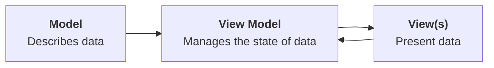

---
{"dg-publish":true,"permalink":"/tutorials/using-a-cloud-hosted-database-part-1/","dgHomeLink":true,"dgShowToc":true}
---


# Using a Cloud-Hosted Database, Part 1

Last year you learned how to build a to-do list app that persisted data in a local database.

However, there are situations where the data created by one user in an app needs to be seen by another user of that app.

In these situations, we can persist data within a database stored "in the cloud", and configure our database to share data between users, as needed.

By the way – the term "cloud computing" just means that somewhere, a computer kept in a facility referred to as a "server farm" is running the database software.

A server farm is a building that contains many computers, usually all connected to the Internet.

Here is a photo of a rack of servers, kept within a server farm:


<small><div class="o2HfV xP9Y2"><span class="U665a FEdrY EZz41">Photo by <a href="https://unsplash.com/@wildmax?utm_content=creditCopyText&amp;utm_medium=referral&amp;utm_source=unsplash">Massimo Botturi</a> on <a href="https://unsplash.com/photos/electronic-wire-lot-zFYUsLk_50Y?utm_content=creditCopyText&amp;utm_medium=referral&amp;utm_source=unsplash">Unsplash</a>
  </span></div></small>

As app developers, by using frameworks, or third-party libraries, we can make use of cloud-hosted databases relatively easily.

In this tutorial, you will begin to learn how to use [Supabase](https://supabase.com) within an iOS project to store data in a cloud-hosted database.

## Obtain the starting point project

As a starting point for this tutorial, you can [download this file](https://www.russellgordon.ca/lcs/2023-24/ics3u/Todo-CloudDatabase.zip).

It contains a version of a to-do list app where items to complete are stored in memory only.

Once downloaded, you may need to double-click the `zip` file to de-compress it:


Then open the `Todo-CloudDatabase` folder, and double-click the blue `.xcodeproj` file:


Xcode will open, and you should see something like this:


Before you try out the app, you must set a *bundle identifier*. This uniquely identifies your app to the Simulator device or physical device that you run the app on. To set the bundle identifier, first select the blue project file at top-left, then select the **Signing & Capabilities** tab:


In the **Bundle Identifier** field, replace this value:

```
replace.with.your.reverse.domain.name.TodoList
```

... with something like this (for example, if your name is Sophia Chen):

```
ca.chen.sophia.TodoList
```

... like this:


Now try out the app in the Simulator:


You should see that you can add to-do items, edit them, delete them, and toggle their completion status. 

### Create a local repository

Before continuing, it's important to enable source control.

If you open the **Source Control** navigator, then click on **Repositories** tab, you will notice that there is no local repository:


To fix this, select the menu sequence **Integrate > New Git Repository...**:


Then click the **Create** button:


### Create the remote repository

Once that is done:

1. Expand the disclosure triangle for the `Todo-CloudDatabase` local repository. 
2. Expand the disclosure triangle for the `Remotes` folder.
3. Two-finger tap or right-click and choose the option to create a new remote.

Like this:


When the next dialog appears, you can leave the default options, then press the **Create** button:


You should see that the remote has been created:


## Separation of Concerns

We have previously learned that it is ideal to keep model code separated from view code.

A **view** is anything a user sees within an app and interacts with – it's job is to *present* data.

A **model** is a representation of the data your app needs to work with.

However... at present, in almost every program you have written so far, the *state* of model data – how many to-do items there are, how many landmarks are shown in a list – has lived within the view.

When we want to perform a CRUD operation (create, read, update, or delete some data) the *code to make that happen is in the view*.

As our programs grow in size, that can become a problem. It can lead to:

- overly long views (too many lines of code)
- duplication of code (when modifying an instance of a data type, the code to do this in different views might look practically identical)

### The MVVM design pattern

So, there is a *software design pattern* known as MVVM, which stands for **Model-View-ViewModel**.

Model and view code work exactly as you already understand them to.

When we introduce a **view model**, it takes over the job of managing the *state* of the data that is described by our model. The view model also manages the actual work of creating, reading, updating, or deleting data on behalf of views within an app.

A single view model might be used by many views within an app.

Visually, and in general, that looks like this:



If necessary, the view model creates an initial, empty instance of whatever data structures are described by the model. Or the view model might load existing instances of data (for example, from a database).

The view model provides instances of data to view(s) in an app. As needed, views call upon the view model to create, read, update, or delete data on their behalf.

A view model's job is very similar to the job that the [[Activities/Using Observable Classes, Part 2#The context\|model context performs when using SwiftData]].

Let's look at how this can be applied within the to-do list app we have been developing.

### Create the view model

First, create a group named `ViewModel` in your project:


Then create a new Swift file named `TodoListViewModel` inside that group:


> [!TIP]
> 
> Take care to match the spelling and capitalization shown in these examples. It will make it easier to read your code later on.

Now press this button to add another editor on the right side of your Xcode window:


Then arrange the windows such that `LandingView` is open on the right, and `TodoListViewModel`  is open on the left:


Copy and paste the following code into `TodoListViewModel`:

```swift
import Foundation

@Observable
class TodoListViewModel {
    
    // MARK: Stored properties
    // The list of to-do items
    var todos: [TodoItem]
    
    // MARK: Initializer(s)
    init(todos: [TodoItem] = []) {
        self.todos = todos
    }
    
    // MARK: Functions
    func createToDo(withTitle title: String) {
        
        // Create the new to-do item instance
        let todo = TodoItem(
            title: title,
            done: false
        )
        
        // Append to the array
        todos.append(todo)
        
    }
    
    func delete(_ todo: TodoItem) {
        
        // Remove the provided to-do item from the array
        todos.removeAll { currentItem in
            currentItem.id == todo.id
        }
        
    }
    
}
```

... like this:


Big picture, this places all of the code related to tracking the state of to-do items, and any code connected to modifying to-do items data, into the `TodoListViewModel` class.

Let's briefly examine a few key lines of code in more detail:


1. The `@Observable` keyword indicates that SwiftUI should watch any instances of the view model, so that when data changes, the user interface is updated.
2. The list (array) of to-do items, `todos`, is moved inside the view model.
3. `TodoListViewModel` is a class, so it must have an initializer.
4. The functions to create and delete a to-do item are copied directly from what is currently in the `LandingView` file.

Our next job is to remove the code that manages data from the *view*, and instead make use of the *view model* to do that work.

This is important progress, so be sure to commit and push your work at this point using the following message: 

```
Added a view model to manage state within the app, and handle CRUD (create, read, update, delete) operations.
```

### Use the view model

Now we will make modest edits to use the view model within the `LandingView` view.

First, where the `todos` array is currently created:

```swift
// The list of to-do items
@State var todos: [TodoItem] = exampleItems
```

...instead create an instance of `TodoListViewModel`:

```swift
// The view model
@State var viewModel = TodoListViewModel()
```

... like this:


On line 21 in `LandingView`, the source of truth for data within the app – an instance of the view model – is now created.  This means the initializer function – on lines 18 to 20 in `TodoListViewModel` – is run. In turn, the initializer of the view model creates an empty array of to-do items.

We will fix the error on line 29 in `LandingView` in a moment.

First, scroll down to the functions that still exist in `LandingView`:


Highlight both functions:


... and delete them:


This is all OK, because earlier, we moved the functions over to the view model:


Now, all we need to do is make the code in the view actually use the instance of the view model that we created a moment ago.

Scroll up in `LandingView` to around line 29:


Change the code:

```swift
List($todos) { $todo in
```

... to:

```swift
List($viewModel.todos) { $todo in
```

... like this:


That causes the `List` structure to use the `todos` array that is now inside the view model, instead of trying to use the `todos` array that was previously part of `LandingView` directly (recall we deleted it a moment ago).

Finally, scroll down a bit further to where the the `delete` function and `createToDo` functions are invoked:


Since those functions are part of the view model, we can access them by simply prepending `viewModel.` in front of the function names, like this:


... and this:


Now, try out the app again. You should see that as before, you should see that you can add to-do items, edit them, delete them, and toggle their completion status:


Now, you might be wondering – nothing in the way the app works has changed! This was a waste of time! Not so – the number of lines of code in the view has been reduced by nearly 40%.

Additionally, making use of a view model sets us up to keep the code that communicates with the cloud-hosted database entirely separate from the code that creates our user interface – the views. We are separating the major pieces of functionality within our app, and this a Good Thing.

Be sure to now commit and push your code, using this message:

```
Made use of the view model within our view to manage state.
```

## Supabase

Supabase is a company that offers cloud-hosted databases that can be integrated within apps developed on a wide variety of platforms – not just iOS.

### Create an account

To begin using this service, you must first create an account. This is a one-time-only requirement, and you can make use of your existing account on GitHub to use Supabase.

So, first, [follow this link to sign in to GitHub](https://github.com/login) using your existing account.

Then, [sign in at Supabase](https://supabase.com/dashboard).

You should see an interface something like this:


Select **Continue with GitHub**.

You will then see this:


Select the green **Authorize supabase** button.

After a moment, you will be logged in to Supabase, and presented with this screen:


> [!TIP]
> 
> Do not worry if you briefly see a message at top right that says `Failed to create your profile.` That will go away after a moment, and does *not* impact your ability to use the service, in any case.

### Create a new project

Begin by clicking either one of the green **New Project** buttons:


The first time you create a project, you will be prompted to create an organization:


Type `Lakefield College School` for the **Name** field and then select `Educational` for the **Type of organization** dropdown, then click **Create organization**:


After a moment, you will be brought to this screen to create a new project:


Make the following selections – and – **very important** – be sure to copy and save the database password in a safe place on your own computer – you **must** be able to find this password later on:


You will then see something like this screen – it may take a few minutes to set up your project:


After a little while, the screen will change to the following:


You are ready to create a table in your cloud-hosted database!

### Create a table

Select **Table Editor** button:


Then press the green **Create a new table** button:


Name the table `todos`:


Add a description of `Holds all the to-do items saved by users in my app`:


Then select the checkbox to *disable* row-level security:


You will get a pretty stern warning about this choice – do not worry – this is only temporary, while we are learning – so go ahead and select the green **Confirm** button:


You will then see the following:


Scroll down a bit to the **Columns** section:


You are going to add columns that match the properties of the `TodoItem` structure in your Xcode project:


So, first, delete the `created_at` column:


Leave the `id` column as is.

Add a `title` column:


Then add a `done` column:


Make sure the spelling of the column name, and the related data type, match what is shown above.

Then click the green **Save** button.

You should see an interface like the following:


You are all set to begin creating data in this table.

### Add data to the table

Using the green **Insert** button, add three rows of data to the table:


For the data:

- let the database automatically generate the `id` value
- select a title for the to-do item
- set the `done` value to `false`

... then press the green **Save** button:


The to-do items don't need to be exactly as shown, but please don't spend time adding dozens of to-do items right now:


### Modifying a table's structure

You might have noticed that when adding data, `NULL` was an option. You can think of `NULL` in a database as equivalent to `nil` in a Swift program.

Both the `title` of a to-do item and it's completion status, `done`, should always have a value.

Therefore, let's learn how to modify the structure of a table and correct this.

Click the three dots `•••` beside the table name and then **Edit Table**:


Next to the definition of the `title` column, click the gear icon, `⛭` and then de-select the **Is Nullable** option:


... so it looks like this:


Then do the same for the `done` column.

After adjusting both columns, press the green **Save** button:


So, now the table is set up the way we need it to be, for now.

How do we get the data out of this table, and into our app?

## The Web

The Internet, it's related technologies, and particularly the World Wide Web, or "the Web" for short, are at the core of many things we do in a day.

This is a brief sidebar to explain a bit about how information is sent between computers using the Web.

### Headers

First, try visiting this page in your web browser:

[https://www.russellgordon.ca/lcs/hello.html](https://www.russellgordon.ca/lcs/hello.html)

The content of that web page, when Mr. Gordon added it to his website, looked like this:

```html
<html>
	<head>
		<title>A very small web page</title>
	</head>
	<body>
		Hello, world!
	</body>
</html>
```

A web browser (on your computer) interprets the HTML – which stands for *hypertext markup language* – sent by a web server (a computer somewhere else in the world) and shows the content.

Often, there are other files that control the appearance of the page (CSS – *cascading style sheets*) and behaviour of the page (JS – *JavaScript*).

However, there is other information that is sent by the web server when a web browser makes a request – these are called *headers* – and they provide additional information about the content being sent.

Open the **Terminal** app on your computer, using the Spotlight feature to find it:


At the prompt that appears, type this command, then press **Return**:

```bash
curl -i https://www.russellgordon.ca/lcs/hello.html
```

In general, `curl` is "a tool for transferring data from or to a server using URLs".

The command above asks a program named `curl` to fetch the web page and show us the contents of the requested file, along with any headers that the server provides for that document.

You should see output similar to the following:


In a similar way, we are now going to use `curl` to fetch the data from our database table hosted by Supabase.

### Obtaining project details

Every project in Supabase has a *URL* that it is accessed from, and a *key* that ensures the user accessing the project is allowed to do so.

> [!NOTE]
> 
> There are other layers of authentication involved, but we are omitting those for the time being.

Open the **Project Settings** page:


Then select the **API** option (this stands for *application programming interface*):


On the resulting page, there are two pieces of information that you need.

Copy the **URL** and the **anon public** key to a safe place on your computer, such as a text file stored in your **Computer Studies** folder. You will need this information later on.


### Fetching table data

We will use `curl` to fetch all the data in the `todos` table.

Select the **API Docs** page:


Then select the link for the `todos` table:


Now select the **Bash** option at top right:


Next, there is an option, also at top-right, to show the API key – click the **hide** button:


Then, select **(anon) public**:


Now the documentation page for Supabase automatically generates the `curl` commands that you can use to query your database from the command line.

Note that this is *not* how we will obtain the data for our app – but this is useful to explain how it is that Supabase sends us the information in our database.

Scroll down to the **Read All Rows** option, then copy the command:


This command uses `curl` to request a web page from the Supabase web server. It sets several *headers* to identify which project to pull data from. The `apikey` is a secret (for your project only) and that lets Supabase know that it is you (and not someone else) requesting data from your database.

So, now, paste that command into your **Terminal** window:


... then press the **Return** key:


You should see output that provides the contents of the `todos` table.

This is how Supabase sends us data (and in turn, how we send data to Supabase).

It is all done by making requests over the World Wide Web.

In the next part of this tutorial you will learn a little about the format of the data being sent from Supabase, and how to use the actual Supabase library to much more easily obtain data and use it within your to-do list app.

