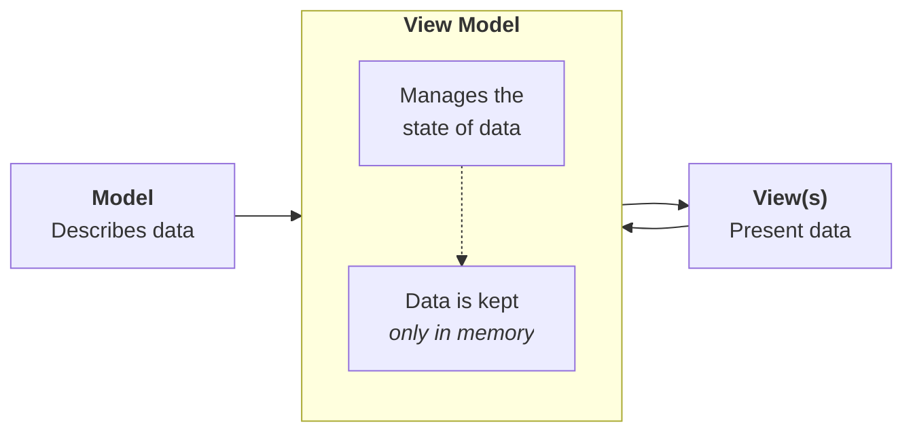
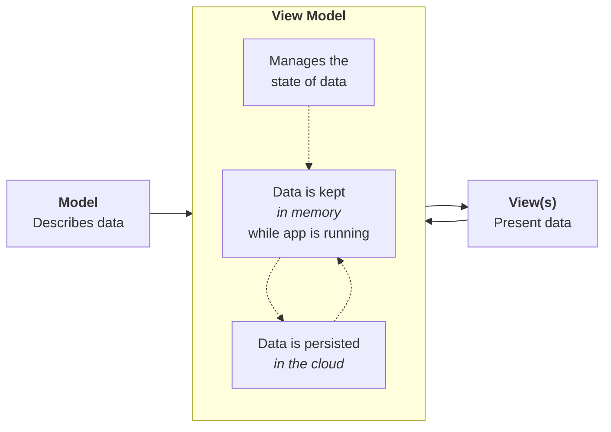
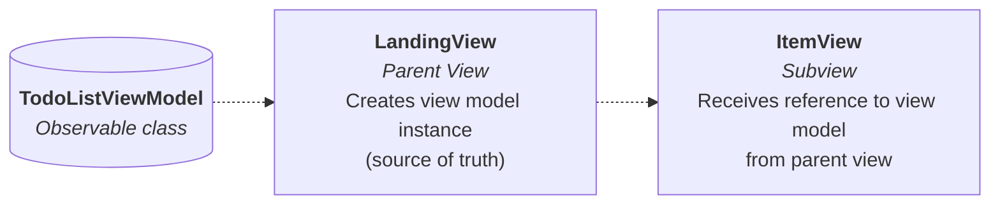
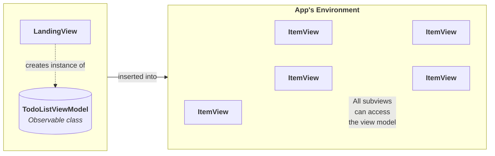

---
{"dg-publish":true,"permalink":"/tutorials/using-a-cloud-hosted-database-part-2/","dgHomeLink":true,"dgShowToc":true}
---


# Using a Cloud-Hosted Database, Part 2

In [[Tutorials/Using a Cloud-Hosted Database, Part 1\|the first part]] of this task, you learned about the MVVM design pattern and how it promotes separation of concerns within an app. You set up a Supabase account and created a database to store the to-do list items. Finally, you saw how Supabase sends data from the database over the World Wide Web.

In this continuation of that tutorial, you will learn how to consume data from a Supabase cloud-hosted database directly within an iOS app.

## Understanding JSON

In part 1 you learned how to [[Tutorials/Using a Cloud-Hosted Database, Part 1#Fetching table data\|see the items in your database table]] over the web, except you used the `curl` command-line app as your "web browser".

Right-click and [[Tutorials/Using a Cloud-Hosted Database, Part 1#Fetching table data\|open those instructions again]]. Follow them to refresh your memory so that you see output like this in the terminal:


So, what is this information that was returned when we made our request to the database?

```json
[{"id":1,"title":"Call Mom","done":false}, 
 {"id":2,"title":"Go for a run","done":false}, 
 {"id":3,"title":"Have a nap","done":false}]
```

The information shown there is simply plain text – however, certain rules are followed so that the information is in a predictable format.

From last year, recall that **JavaScript Object Notation** format, or **JSON**, is a set of rules used to format information sent over the web from one computer to another. In this case, JSON-formatted data is being sent to us by the Supabase platform.

In JSON:

- square brackets mark the start and end of an array
- curly brackets mark the start and end of an object
- an object is composed of data
	- data are sent in name/value pairs
		- the name comes before a colon
		- the value comes after a colon

So for this data:

```json
[{"id":1,"title":"Call Mom","done":false}, 
 {"id":2,"title":"Go for a run","done":false}, 
 {"id":3,"title":"Have a nap","done":false}]
```

... there is:

- one array
- three objects are in the array
- each object has three name/value pairs

Our goal is to get that data out of it's plain-text JSON format, and into the Swift data structures we set up in part 1. 

Each JSON object will correspond to an instance of our `TodoItem` structure:

```swift
struct TodoItem: Identifiable {
    let id = UUID()
    var title: String
    var done:  Bool
}
```

The JSON array corresponds to the `todos` array we set up in our view model:


We are going to use the framework provided by Supabase so that this process of converting data kept in JSON format into Swift data structures is super convenient and automatic.

> [!NOTE]
> 
> Eagle-eyed readers may have noticed that the `id` property being sent to us by Supabase is a simple integer value (`1`, `2`, `3`, and so on) but the `id` property in our `TodoItem` structure is a `UUID` or universally-unique identifier, which looks something like this: `5F944282-A194-4A6C-A1E4-2022FBD8D8A8`
> 
> Don't worry. We'll fix this in a moment, and it's easy to do!

## Adding the Supabase framework

To add the Supabase framework, from the menus, select **File > Add Package Dependences...**:


Paste the address shown here in the top-right corner:

```
https://github.com/supabase-community/supabase-swift
```

You should see the following:


Then select **Add Package** and you will see this screen briefly:


On the screen that appears, expand the window if needed, then for each package product shown, change the option for the **Add to Target** column to read **TodoList** (this is the app or target name of your project):


Finally, press the **Add Package** button:


If all goes well you will see the frameworks that have been added in the lower left corner of the Xcode window: 


This is a small but key step. Please go ahead and commit and push your work with this message:

```
Added the Supabase framework.
```

## Documentation

The rest of this tutorial will walk you through how to begin using Supabase with a SwiftUI application.

Supabase is, however, an exceptionally well-documented framework:


Please [visit the documentation that can be found here](https://supabase.com/docs/reference/swift/installing), and add a bookmark for future reference.

## App architecture

A tremendous benefit of separating concerns within an app is that when you make changes to how data is persisted the view layer never needs to know about it.

As a result, when we begin using Supabase to persist data for this app, no source code in the view layer needs to be modified. We will only be modifying the model and view model layers.

Here is the current overall architecture of our to-do list app:



We will be modifying the architecture so that it works as follows:



## Load data from the cloud

Our first step will be to use the Supabase framework to essentially run this command in the cloud database and then show the results in our app:

```sql
SELECT *
FROM todos
```

Try running the app in the Simulator or on a device right now, and you will note that when it opens, there are no to-do items showing:


There are no to-do items because the data is being kept in memory only, and is not persisted at all right now. We just opened the app, so of course, there are no to-do items to show.

However, we know there are to-do items in our cloud-hosted database, so let's get these loaded and showing up in the app.

### Identifying your app to Supabase

The Supabase servers host databases for many different developers and projects.

When a SwiftUI application reaches out to a cloud-hosted database on Supabase, the Supabase servers need to know two things:

1. What database the application is trying to connect to
2. That the application is authorized to connect to that database

Recall that you were able to fetch the data from your database by running this command in the Terminal:


The part highlighted in blue is how the database to connect to is identified. Each Supabase project is assigned a different random identifier, which is used to form the URL, or address, that an app reaches out to so as to fetch data.

The part highlighted in red is how your app proves to the Supabase servers that it has permission to speak to the indicated cloud-hosted database.

So to identify our app to Supabase, we must create an instance of the `SupabaseClient` class and provide those two pieces of information.

To do this, expand the **Helpers** group in Xcode and create a new Swift file named `Supabase.swift`, like this:


Then add the following code to that file:

```swift
import Supabase

let supabase = SupabaseClient(
  supabaseURL: URL(string: "https://REPLACE_WITH_PROJECT_URL.supabase.co")!,
  supabaseKey: "REPLACE_WITH_ANONYMOUS_PUBLIC_KEY"
)

```

... like this:


Now, in Supabase, open your project settings page by clicking the gear icon:


It will look like this:


Then select the API link:


You will see a page like this:


The first piece of information you need is the URL – this is the unique identifier for your project at Supabase – press the **Copy** button to get this information into your clipboard:


Highlight this part of the code in `Supabase.swift`:


... then press **Command-V** to paste your unique project URL in it's place:


Next, highlight the anonymous public key – this is how your app proves to Supabase that it is authorized to connect to your database:


Press the **Copy** button to place the key in your clipboard, then highlight this code in `Supabase.swift`:


... then press **Command-V** to paste the key:


This is useful progress, so please commit and push your work with this message:

```
Added a helper file to identify our app to the Supabase servers.
```

### Adjust the model

We must adjust the model, for two reasons.

First, we saw earlier that when asking Supabase for the information from our database, we get this JSON-formatted text as a response:

```json
[{"id":1,"title":"Call Mom","done":false}, 
 {"id":2,"title":"Go for a run","done":false}, 
 {"id":3,"title":"Have a nap","done":false}]
```

Supabase will automatically convert that JSON-formatted information into Swift data structures for us. To allow this, we must mark the `TodoItem` structure as `Codable`. This just means that information can be decoded from JSON into instances of the `TodoItem` structure – and vice-versa – also encoded instances of the `TodoItem` structure into JSON (we will use this later on when sending data back to the Supabase servers).

So, please make this first edit to your `TodoItem` structure:


You are changing this line from:

```swift
struct TodoItem: Identifiable {
```

...to:


```swift
struct TodoItem: Identifiable, Codable {
```

This means the `TodoItem` structure now conforms to two protocols – `Identifiable` and `Codable`.

> [!TIP]
> 
> You can ignore the yellow warning message that appears. It will go away after our next edit.

Second, recall that in our database, each to-do item is uniquely identified by an integer value. 

We must modify our `TodoItem` structure to reflect this.

So, please make the following change:


You are changing this line from:

```swift
	let id = UUID()
```

...to:


```swift
    var id: Int?
```

This means each to-do item in our app is uniquely identified by an integer, instead of a universally unique identifier.

> [!NOTE]
> 
> You will see a bit later on why we chose to make the data type an optional `Int`.

### Adjust the view model

Now we will adjust the view model to retrieve our to-do items from the cloud-hosted database.

Navigate to the `TodoListViewModel` file, and place your cursor at the start of the functions section, like this:


Then copy this code:

```swift
    func getTodos() async throws {
        
        do {
            let results: [TodoItem] = try await supabase
                .from("todos")
                .select()
                .execute()
                .value
            
            self.todos = results
            
        } catch {
            debugPrint(error)
        }
        
    }
```

... and paste it after the initializer but before the `createToDo` function, like this:


If needed, press **Command-`A`** and then **Control-`I`** to re-indent your code and keep it tidy.

There's a lot going on here, so let's break that down:


> [!DISCUSSION]
> 
> 1. The `async` keyword marks the `getTodos` function as asynchronous. This means the function is one that may *potentially* be run in parallel with other work our app is performing, such as keeping the user interface responsive to input from the user. Fetching data from the Supabase servers occurs over the web. That task can take a variable amount of time. While it occurs, if other work within our app can be handled by other processor core(s), we have an example of *concurrency* in action. Concurrency occurs when asynchronous tasks are run in parallel.
> 2. The `throws` keyword means this function can generate errors. Errors must either be handled within this function itself, or by the code that invokes (calls) this function.
> 3. A `do` block handles errors that might occur when invoking a function that can throw errors. If errors occur, they will be handled by the `catch` block below.
> 4. We create a local array of `TodoItem` instances; these will be created by the data being retrieved from the cloud-hosted database at Supabase.
> 5. Retrieving data from the cloud-hosted Supabase can generate errors, so the function must be invoked using the `try` keyword. The function provided by the Supabase framework to retrieve data runs asynchronously, so it must be invoked using the `await` keyword. [Antoine van der Lee](https://www.avanderlee.com/about/) describes it this way: "Await is waiting for a callback from their buddy, async." Formally, it means our program waits for results from the Supabase framework and continues only after a result arrives.
> 6. From the `supabase` instance of the `SupabaseClient` class, we indicate that we want to select all data from the `todos` table, execute that query, and obtain the results (decoded from their JSON representation – see earlier notes in this tutorial).
> 7. We assign the results to the `todos` array that is already a part of our view model.
> 8. If any errors occurred when the code in the `do` block was run, they will be caught here and an error message will be printed to, hopefully, identify what happened. These results are printed to the debugging console in Xcode, which we can view when running our app.

So, now we have a function that retrieves the data – but we need to invoke it.

Recall from our earlier lesson on structures vs. classes that the [[Concepts/Structures vs. Classes#Reference types\|job of an initializer]] is to populate all the stored properties of a class with the information needed for a class to do it's job.

So, we must make a small change to the initializer of the view model.

Scroll up to that part of the file:


Immediately after line 19 shown in the screenshot above, add the following code:

```swift
        Task {
            try await getTodos()
        }
```

... like this:


This creates a block of code that is run asynchronously. We invoke the `getTodos` function that was just authored to retrieve to-do items from the cloud-hosted database. 

Try running the app now in the Simulator or on a device. You should see whatever to-do items that are in your database now shown inside the app instead:


This is excellent progress that you don't want to lose, so please commit and push your work with this message:

```
Adjusted view model to pull to-do items from the database hosted at Supabase.
```

## Write data to the cloud

From here, further modifications to the view model are all that is required.

In this section of the tutorial we will author code to add a new to-do item.

This is equivalent to interacting directly with the database and running an `INSERT INTO` command, which is how a new row is added to a table.

For example:

```sql
INSERT INTO todos (title, done)
VALUES ('Walk the dogs', false)
```

### Using the SQL Editor

We can try this out directly within the Supabase SQL Editor, much like you experimented with running queries in the **DB Browser** app earlier this year.

From the Supabase website, select the **SQL Editor** icon:


You will come to a page that looks like this:


If you cut and paste the query above in the top half of the interface, then press the green **Run** button, you should see results something like the following:


Verify that the query added data to the `todos` table by navigating to the **Table Editor**:


After selecting the `todos` table you should see the newly inserted data:


### From the app

If you run your app again from Xcode, you should see the newly created to-do item:


Try adding a new to-do item, then force-quitting the app, then opening it again:


Note that the newly created to-do item is *not* persisted. 

Look at the current code in the new model to understand why:


On line 46, a new to-do item is created.

On line 52, that to-do item is appended to the `todos` array in the view model.

The user interface updates to show this change, but if the app is closed, the new to-do item is lost.

From the view model, we must adjust the `createToDo` function so that it writes the new to-do item to the cloud-hosted database.

Copy this code into your clipboard:

```swift
func createToDo(withTitle title: String) {
	
	// Create a unit of asynchronous work to add the to-do item
	Task {
		
		// Create the new to-do item instance
		// NOTE: The id will be nil for now
		let todo = TodoItem(
			title: title,
			done: false
		)
		
		// Write it to the database
		do {
			
			// Insert the new to-do item, and then immediately select
			// it back out of the database
			let newlyInsertedItem: TodoItem = try await supabase
				.from("todos")
				.insert(todo)   // Insert the todo item created locally in memory
				.select()       // Select the item just inserted
				.single()       // Ensure just one row is returned
				.execute()      // Run the query
				.value          // Automatically decode the JSON into an instance of TodoItem

			// Finally, insert the to-do item instance we just selected back from the
			// database into the array used by the view model
			// NOTE: We do this to obtain the id that is automatically assigned by Supabase
			//       when the to-do item was inserted into the database table
			self.todos.append(newlyInsertedItem)
			
		} catch {
			debugPrint(error)
		}
	}
}
```

Replace the existing `createToDo` function with that code, like this:


The comments in the code explain what is happening on each line.

Now try running the app again in the Simulator, and add a new to-do item.

Quit the app, and observe how the new to-do item has been persisted:


This is important progress that you don't want to lose, so please commit and push your work with this message: 

```
Adjusted the view model so that newly added to-do items are persisted.
```

## Remove data from the cloud

In this section of the tutorial we will author code to delete a to-do item.

This is equivalent to interacting directly with the database and running a `DELETE FROM` command, which is how a row is removed from a table.

For example:

```sql
DELETE FROM todos
WHERE id = 7;
```

> [!TIP]
> 
> You can try this out directly on Supabase in the SQL Editor panel.
> 
> 
> 
> Be sure you do not forget the `WHERE` clause – otherwise every row of data in the table will be deleted!

Before we continue, let's review the overall architecture of the app:


Note how the view model must manage to-do items held in memory *and* keep the database up-to-date.

If you try deleting a to-do item, then quitting and re-opening the app, you will notice a problem:


The to-do item that was deleted appears again when the app is re-opened.

This occurs because the view model currently just removes the deleted to-do item from the array held in memory – it does not remove the to-do item from the database table held in the cloud:


So, please copy this code into your clipboard:

```swift
func delete(_ todo: TodoItem) {
        
        // Create a unit of asynchronous work to add the to-do item
        Task {
            
            do {
                
                // Run the delete command
                try await supabase
                    .from("todos")
                    .delete()
                    .eq("id", value: todo.id!)  // Only delete the row whose id
                    .execute()                  // matches that of the to-do being deleted
                
                // Update the list of to-do items held in memory to reflect the deletion
                try await self.getTodos()

            } catch {
                debugPrint(error)
            }
            
            
        }
                
    }
```

Replace the existing `delete` function with that code, like this:


Then run your app again in the Simulator. This time, when you delete an item, then close and re-open the app, you will notice that the deletion is persisted.

This is key progress, so once again, please commit and push your work with this message:

```
Adjusted the view model so that deletions are persisted.
```

## Update data in the cloud

There is one final issue to correct.

Run your app in the Simulator or on a device.

Try toggling the completion status of a few to-do items.

Also try changing the text of some to-do items.

Then force-quit the app, and re-open it.

You will notice that the changes are not persisted.

When the completion status of a to-do changes, or the text of a to-do item changes, we must also use the view model to persist these modifications in the database.

So, in this final section of the tutorial for today we will author code to delete a to-do item.

This is equivalent to interacting directly with the database and running an `UPDATE` command.

For example:

```sql
UPDATE todos
SET done = TRUE
WHERE id = 5;
```

> [!TIP]
> 
> You can try this out directly on Supabase in the SQL Editor panel.
> 
> 
> 
> Be sure you do not forget the `WHERE` clause – otherwise every row of data in the table will be updated so that the `done` value is set to `true`!

### Add the update function

Navigate to the view model, which should now look like this, with the existing functions folded up:


After the `delete` function, but before the end of the `TodoListViewModel` class, add the following code:

```swift
 func update(todo updatedTodo: TodoItem) {
        
        // Create a unit of asynchronous work to add the to-do item
        Task {
            
            do {
                
                // Run the update command
                try await supabase
                    .from("todos")
                    .update(updatedTodo)
                    .eq("id", value: updatedTodo.id!)   // Only update the row whose id
                    .execute()                          // matches that of the to-do being deleted
                    
            } catch {
                debugPrint(error)
            }
            
        }
        
    }
```

... like this:


That gives the view model the ability to update to-do items, but, in this case, we need to add a bit of code to the views so that the `update` function on the view model can invoked when needed.

### Sharing access to the view model

The *source of truth* for the view model – where the first and only instance of the `TodoListViewModel` class is created – exists in `LandingView`:


However, the code that handles modifications to a single to-do item exists in `ItemView`:


So, if the view model instance exists on `LandingView`, how do we get access to it from `ItemView`? So that we can update the database when a to-do item changes?

There are two options, and which one we choose depends on our needs and preferences, for the most part.

#### Using @Bindable

The first option is to directly pass a reference from the parent view to the child view, which in general, looks like this:


In this app in particular, directly passing a reference looks like this:



If we wanted to implement this approach, the first step is to adjust the subview, `ItemView`, like this:


Notice the new code on line 15.

`viewModel` is a stored property.

At all call sites for `ItemView` – where instances of `ItemView` are created – the new stored property adds another parameter for which an argument is expected to be provided.

That means adjusting the call sites for `ItemView` within it's own preview as follows:


And then adjusting the call site from the parent view – see line 31:


When there are a very small number of subviews within an app, directly passing a reference using `@Bindable` is a reasonable approach. 

> [!TIP]
> 
> You might be wondering – what is the difference between the property wrapper `@Binding` and the property wrapper we just used, `@Bindable`?
> 
> `@Binding` is only used to access the source of truth for *value* types, like a `String`, `Int`, `Bool`, or a custom structure you have authored. For example, `ItemView` uses `@Binding` to access the current instance of a to-do item (see line 12 in the second screenshot above this note).
> 
> `@Bindable` is used to access the source of truth for *reference*  types that conform to  `@Observable`. The `TodoListViewModel` class is an example of this. To access the source of truth for the view model from the parent view, we use `@Bindable` here in the subview, `ItemView` (see line 15 in the screenshot above).
> 
> In short, `@Bindable` is **only** used with `@Observable` – you can remember this because they both end with "able".

#### Using @Environment

The second option for accessing a view model from views within an app is to do so through the environment.

> [!TIP]
> 
> We first learned about the environment in [[Activities/Using Observable Classes, Part 2#3 – Add the context\|when learning to use SwiftData]] to persist information earlier this year.

If you insert the view model instance into the environment from a root view, all subviews will have access to it through the environment.

In general, that looks like this:


In this app in particular, that looks like this:



> [!NOTE]
> 
> The number of actual `ItemView` instances will vary, of course, depending on how many to-do items there currently are.

In the to-do list app, we can put the view model into the environment, and access it from subviews, as follows.

First, note that as shown above in the diagram, `LandingView` already creates the source of truth, our single instance of the view model, on line 21:


Now, use code folding to fold up the `NavigationView` inside the body property, like this:


Insert the view model instance into the environment by attaching this view modifier to the `NavigationView`:


This means that *any* view created within the scope of the `NavigationView` can reach into the environment and access the instance of the view model. Note that this includes `ItemView`.

Now, switch to `ItemView`, and add this code to reach into the environment and gain access to the view model:


The advantage of accessing the view model through the environment is that call sites do not need to be updated. This can be convenient when there are many different subviews within an app that need access to the view model.

### Actually use the update function

Before continuing, choose which of the options above – using `@Bindable` or `@Environment` – you want to employ. Make the necessary changes.

Now that you have access to the view model inside `ItemView`, you need to use it.

When the text field is modified and changes are submitted by the user, the text field must call the `update` function on the view model to ensure changes are persisted. Make this change, shown on lines 21 to 23 here:


Finally, when the completion status of a to-do item changes, we must also call the `update` function on the view model. Make this final change, shown on line 29 below:


Now try running your app. Make changes to the completion status or the text of to-do items. Quit the app and re-open it. Notice that changes are persisted!

This is key progress, so please commit and push your work using this message:

```
Added an update function and made view model accessible to subviews so that changes to to-do items are persisted.
```

## Fix sort order

When you tested the last set of changes, you might have noticed that the order of to-do items changed.

This can be fixed very easily, by specifying a sort order when refreshing the list of to-do items. We will sort the to-do items by the `id` value assigned to them. As such, to-do items are sorted in the order they were created.

This is equivalent to the following SQL statement:

```sql
SELECT *
FROM todos
ORDER BY id ASC
```

Switch to the view model and add a single line of code to the `getTodos` function:


Now run the app and make changes to the to-do list items. Note that the order of the to-do items does not change.

Commit and push your work with this message:

```
Specified the sort order so that to-do item positions in the list do not change when to-do items are modified.
```